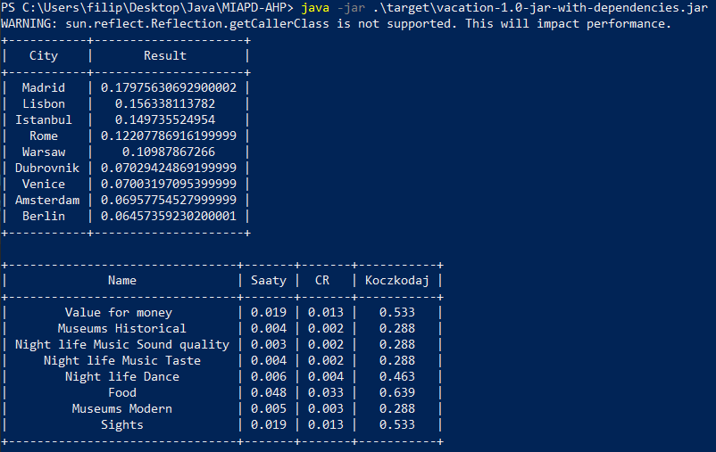

# MIAPD-AHP
Do skompilowania potrzebne jest narzędzie Maven.  
Aby uruchomić program należy go skompilować komendą _mvn package_ a następnie _java -jar target/vacation-1.0-jar-with-dependencies.jar._  
Pliki _criteria.json_ oraz pliki z katalogu _Cities_ to dane wejściowe.  
Istnieje możliwość odpalenia trybu z GUI, wystarczy dodać argument "gui" do polecenia java -jar...

Przykładowy wynik działania programu:
